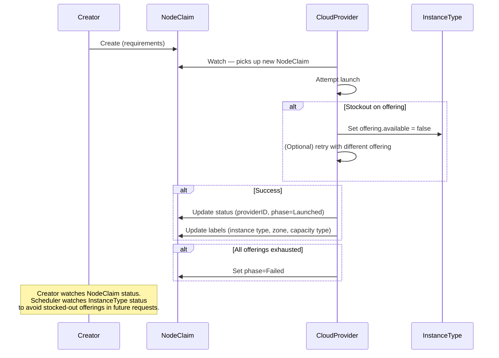

# Feedback Loop / Stockout Handling — Design Scratch Notes

**Date:** March 26, 2026
**Context:** How the system reacts when cloud provider capacity is unavailable. Subsystem of the NodeClaim / CapacityRequest API.

---

## Relevant Functional Requirements

These requirements directly constrain the shape of this subsystem:

- **General-purpose capacity primitive:** The NodeClaim API is usable by any component. The feedback loop must work regardless of who created the NodeClaim.
- **No scheduling logic in autoscalers:** Availability signals must be consumable by the scheduler without requiring autoscalers to interpret or propagate them.

---

## What This Subsystem Must Express

Derived from the functional requirements:

1. **Per-offering availability** — each offering has an independent available/unavailable state. Stockouts are granular to a specific combination (e.g., instance type + zone + capacity type), not a broad signal across all offerings.
2. **Availability propagation** — when a stockout occurs during NodeClaim fulfillment, the signal must reach all consumers of the Potential Capacity API so they avoid the same offering in future requests.
3. **Recovery** — offerings must eventually recover from stockout without manual intervention. The system must assume capacity may become available again.
4. **Fulfillment failure** — when all compatible offerings for a NodeClaim are exhausted, the NodeClaim must transition to Failed with a clear reason. The creator can then decide how to respond.

---

## Design Questions

### 1. How Are Stockouts Signaled?

**Decision: InstanceType.status.offerings as source of truth**

On each stockout, the cloud provider:
1. Sets `offerings[i].available = false`
2. Increments `status.offeringsGeneration`
3. Sets `unavailableSince` timestamp for TTL recovery

All current and future NodeClaims avoid known-bad offerings. The scheduler (or any consumer of the Potential Capacity API) naturally incorporates stockout history through standard watch mechanisms.

### 2. How Do Offerings Recover?

**Decision: TTL-based recovery**

The cloud provider controller runs periodic reconciliation:
- Check `unavailableSince` on offerings marked unavailable
- If > 3 minutes old, set `available: true`
- Increment `offeringsGeneration`

### 3. Can Cloud Providers Retry Internally?

Cloud providers MAY implement internal retry as an optimization:
- Try multiple compatible offerings before failing a NodeClaim
- Reduces round-trips through the API server
- Not required for correctness — just improves latency

This is an implementation detail, not part of the API contract.

### 4. Stockout Granularity

When a stockout occurs for a specific offering (e.g., spot m5.xlarge in us-west-2a), what is the scope of the unavailability signal?

- The stockout marks a single offering on a single InstanceType unavailable.
- If the offering has tenant-specific requirements (e.g., team=frontend), does the stockout affect all tenant configs for that (zone, capacityType, instanceType) tuple, or only the specific offering that failed?
- Cloud providers typically see stockouts at the (zone, capacityType, instanceType) level — they don't distinguish between tenant configs. This suggests the cloud provider should mark all offerings matching the stocked-out (zone, capacityType, instanceType) as unavailable, regardless of tenant config.

**Open — needs decision.**

### 5. Interaction with Hybrid vs. Flat Proposals

The stockout signaling mechanism differs depending on which Potential Capacity API proposal is used:

**Hybrid (API Server):** The cloud provider writes `offerings[i].available = false` on InstanceType CRDs. Consumers watch InstanceType objects and see availability changes through standard API server watches. This is the mechanism described in design questions 1-2.

**Flat (gRPC):** The cloud provider serves fully resolved offerings over gRPC. Stockout handling is internal — the cloud provider simply stops serving the stocked-out offering, or serves it with `available: false`. The consumer sees the change on the next gRPC query/stream update. No InstanceType CRD update is needed.

Both approaches satisfy the "availability propagation" requirement but through different transport mechanisms. The feedback loop contract (stockout → mark unavailable → TTL recovery) is the same; only the transport differs.

### 6. Cascading Stockouts

When an entire zone or capacity type stocks out across many instance types (e.g., all spot capacity in us-west-2a), the cloud provider must update each affected InstanceType individually. There is no bulk availability mechanism in the current design.

**Implications:**
- A zone-wide spot stockout across 700 instance types requires 700 InstanceType status updates (Hybrid approach).
- In the gRPC approach, the cloud provider can stop serving all affected offerings in a single update to its internal state, but consumers still see the change per-offering.
- If bulk updates become a bottleneck, a zone-level or capacity-type-level availability signal could be added as an optimization, but this adds complexity.

**Open — monitor during POC scale testing.**

---

## Proposed Spec

### InstanceType Status with Stockout Tracking

```yaml
status:
  offeringsGeneration: 42  # Increments on any change
  
  offerings:
    - requirements:
        - key: topology.kubernetes.io/zone
          operator: In
          values: ["us-west-2a"]
        - key: capacity.k8s.io/capacity-type
          operator: In
          values: ["spot"]
      cost: "0.035"
      available: false  # Stockout — will auto-recover after TTL
      unavailableSince: "2026-03-24T10:30:00Z"
    
    - requirements:
        - key: topology.kubernetes.io/zone
          operator: In
          values: ["us-west-2a"]
        - key: capacity.k8s.io/capacity-type
          operator: In
          values: ["on-demand"]
      cost: "0.096"
      available: true
```

### NodeClaim Failure

When all compatible offerings are exhausted, the cloud provider marks the NodeClaim as failed:

```yaml
status:
  phase: Failed
  conditions:
    - type: Launched
      status: "False"
      reason: "Stockout"
      message: "All compatible offerings exhausted"
```

### Flow



---

## Open Questions

1. **Scheduler batching:** Should the scheduler wait briefly before creating more NodeClaims to see if offerings change? Or is it sufficient to rely on the watch — by the time the scheduler processes the next pending pod, the InstanceType status will already reflect the stockout.
2. **Reservation tracking:** How does the cloud provider track in-flight NodeClaims against reservation capacity? A reservation with 5 remaining slots and 3 pending NodeClaims should not allow 5 more.
3. **Stockout granularity:** See design question 4. Does a stockout affect all offerings for a (zone, capacityType, instanceType) tuple regardless of tenant config?
4. **Cascading stockout performance:** See design question 6. Will per-InstanceType updates be a bottleneck during zone-wide stockouts in the Hybrid approach?

---

## Related Design Notes

- **NodeClaim API:** See `nodeclaim-api-scratch.md` for the capacity request contract
- **Potential Capacity API:** See `potential-capacity-api-scratch.md` for offering structure
- **Gang Scheduling:** See `gang-scheduling-design-scratch.md` for stockout during atomic batch provisioning
