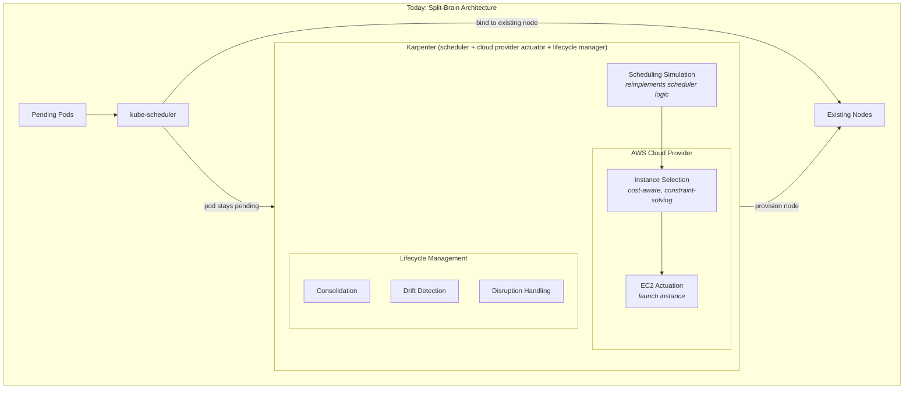
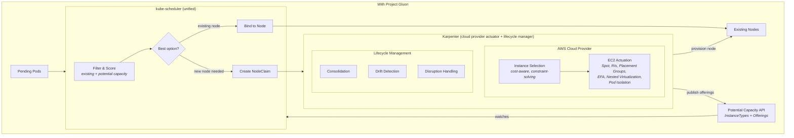

# Project Gluon: Architecture Diagram — What Karpenter Becomes

Recreate this in draw.io. Two side-by-side diagrams: "Today" and "With Project Gluon."

## Today

## With Project Gluon

## Key Differences to Highlight

- **Removed from Karpenter:** "Scheduling Simulation" box — this moves into kube-scheduler.
- **Added to kube-scheduler:** Awareness of potential capacity (not just existing nodes).
- **Karpenter core retains:** Lifecycle management (consolidation, drift detection, disruption handling). These are upstream Karpenter features, cloud-provider-agnostic.
- **AWS cloud provider layer retains:** Instance selection, EC2 actuation, and deep integration with EC2 features (Spot, Reserved Instances, Placement Groups, EFA, Nested Virtualization, Pod Isolation).
- **New connection:** Potential Capacity API sits between Karpenter (publishes offerings) and kube-scheduler (consumes offerings).
- **NodeClaim** is the handoff contract between scheduler and Karpenter.
