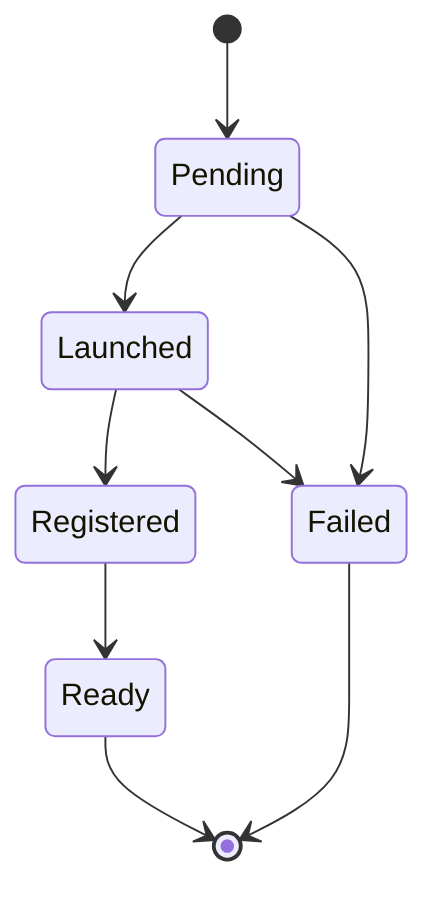

# NodeClaim / CapacityRequest API — Design Scratch Notes

**Date:** March 26, 2026
**Context:** The API for requesting and managing provisioned capacity.

---

## Relevant Functional Requirements

These requirements directly constrain the shape of this API:

- **Scheduling-aware autoscaling:** Provisioning is a first-class scheduling action. The scheduler must be able to request new capacity as part of its normal scheduling loop.
- **Autoscaler-agnostic primitives:** The API must be general enough that both CAS and Karpenter can be implemented on top of it.
- **No scheduling logic in autoscalers:** The scheduler owns the decision of what to provision. Autoscalers should not need to replicate scheduling logic to make provisioning decisions.
- **General-purpose capacity primitive:** The API must be usable by any component that needs to request capacity — scheduler, autoscaler, disruption controller, or static provisioning tooling.

---

## What This API Must Express

Derived from the functional requirements:

1. **A request for capacity** — any component declares "I need a node with these properties"
2. **Requirements-based selection** — the request carries requirements (CPU ≥ 4, zone ∈ {a, b}), not a specific instance type. The cloud provider selects a concrete instance type that satisfies the requirements.
3. **Fulfillment result** — what was actually provisioned: the cloud provider updates the NodeClaim's labels with the resolved node's labels (instance type, zone, capacity type, etc.) and sets status fields (provider ID, node name, capacity, allocatable).
4. **Failure states** — stockout, all compatible offerings exhausted, timeout.
5. **Provider-specific configuration** — how to attach cloud-provider-specific details (AMI, network config, etc.) without baking provider concepts into the core API.
6. **Lifecycle ownership** — the creator (scheduler, autoscaler, etc.) creates the NodeClaim. The cloud provider owns its lifecycle from that point forward — fulfilling the request, updating status, and managing the underlying instance through termination.

---

## Design Questions

### 1. Requirements vs. Specific Offering

A capacity request can be expressed at different levels of specificity — from broad requirements that match many offerings to a reference to a single specific offering.

**Decision: Full generic requirements — cloud provider fulfills**

The creator provides the complete set of requirements that the resulting node must satisfy. The cloud provider is free to fulfill the request however it sees fit — selecting instance types, retrying on stockout, optimizing for cost or availability — as long as the resulting node satisfies the stated requirements. The NodeClaim is a contract: the creator declares what it needs, the cloud provider delivers it.

**Rejected alternatives:**
- *Specific offering reference* — clean separation of decision logic but every stockout requires a new NodeClaim from the scheduler, adding latency. Unnecessarily constrains how the cloud provider fulfills the request.
- *Ranked offering list* — reduces round-trips while keeping decision logic in the scheduler, but adds API complexity and still constrains the cloud provider to a fixed set of options.

### 2. Provider-Specific Configuration

Cloud providers require provider-specific configuration (AMI, network config, etc.) that doesn't belong in the core API. The question is how to attach it.

**Decision: Generic provider configuration reference, with generalized name**

A generic reference field (name TBD — e.g., `providerConfigRef`, `capacityConfigRef`) points to any provider-specific CRD. The core API doesn't know or care what it contains. Simple, extensible, and separates shared config from individual requests.

**Rejected alternatives:**
- *Inline provider config* — single object but bloats the NodeClaim and makes it harder to share config across requests.
- *Provider config via offering* — eliminates a separate config mechanism but tightly couples offering identity to provider config, requiring new offerings for every config change.

### 3. Lifecycle States

What phases does a NodeClaim go through?



- **Pending** — request created, cloud provider has not yet acted.
- **Launched** — cloud provider has created the underlying instance. Provider ID is set.
- **Registered** — the node has joined the cluster (Node object exists).
- **Ready** — the node is ready to accept pods.
- **Failed** — cloud provider could not fulfill the request (stockout, exhaustion, timeout).

### 4. Group Relationship

NodeClaims reference a NodeClaimGroup via `spec.groupRef` to declare shared fate:

- NodeClaim spec is the same whether created standalone or as part of a group.
- Group membership is expressed through `spec.groupRef`.
- The group holds shared requirements, allocation strategy, and topology constraints.
- The cloud provider uses the group reference to coordinate atomic provisioning and updates group status.

See `gang-scheduling-design-scratch.md` for the full group scheduling design.

---

## Proposed Spec

Based on the Karpenter NodeClaim (`karpenter-testing-fork/pkg/apis/v1/`), genericized to remove Karpenter-specific lifecycle concerns and serve as a general-purpose capacity primitive.

### Changes from Karpenter NodeClaim

**Spec — kept:**
- `requirements` — the core contract: generic requirements the resulting node must satisfy
- `taints` — applied to the resulting node
- `startupTaints` — temporary taints applied at startup, expected to be removed by a DaemonSet or controller. Allows initialization ordering without affecting provisioning decisions.
- `resources` — minimum resource requests for the node to launch
- Provider config reference — kept as a pattern, renamed from `nodeClassRef` to `providerConfigRef` (name TBD)

**Spec — removed (Karpenter-specific lifecycle):**
- `terminationGracePeriod` — disruption concern, not a provisioning primitive
- `expireAfter` — disruption concern, not a provisioning primitive

**Status — kept:**
- `nodeName` — the corresponding node object
- `providerID` — cloud provider instance identifier
- `capacity` / `allocatable` — actual node resources
- `conditions` — Launched, Registered, Ready (removed Karpenter lifecycle conditions)

**Status — removed (Karpenter-specific lifecycle):**
- `imageID` — provider-specific, belongs in provider-level status if needed
- `lastPodEventTime` — disruption scheduling concern
- Condition types: `Consolidatable`, `Drifted`, `Drained`, `VolumesDetached`, `InstanceTerminating`, `ConsistentStateFound`, `DisruptionReason`

**Status — added:**
- `phase` — explicit lifecycle phase (Pending, Launched, Registered, Ready, Failed)

### YAML

```yaml
apiVersion: capacity.k8s.io/v1
kind: NodeClaim
metadata:
  name: sched-abc123
  # Labels are updated by the cloud provider after fulfillment
  # to reflect the resolved node properties
  labels:
    node.kubernetes.io/instance-type: m5.xlarge
    topology.kubernetes.io/zone: us-west-2a
    capacity.k8s.io/capacity-type: spot
spec:
  # Requirements filter which offerings/instance types are eligible.
  # These are label-selector constraints (e.g., "only instance types with >= 4 CPUs",
  # "only these zones", "only spot"). They narrow the set of options the cloud
  # provider may choose from.
  requirements:
    - key: capacity.k8s.io/instance-cpu
      operator: Gte
      values: ["4"]
    - key: capacity.k8s.io/instance-memory-mb
      operator: Gte
      values: ["8192"]
    - key: topology.kubernetes.io/zone
      operator: In
      values: ["us-west-2a", "us-west-2b"]
    - key: capacity.k8s.io/capacity-type
      operator: In
      values: ["spot", "on-demand"]

  # Taints applied to the resulting node
  taints:
    - key: team
      value: frontend
      effect: NoSchedule

  # Temporary taints removed after initialization (e.g., by a DaemonSet)
  startupTaints:
    - key: node.kubernetes.io/not-ready
      effect: NoSchedule

  # Resources express the minimum allocatable capacity the node must have
  # for the pods being placed on it. A node may match requirements (e.g.,
  # instance type has >= 4 CPUs) but still not have enough allocatable
  # capacity after system/kubelet overhead. Resources ensure the node
  # can actually fit the workload.
  resources:
    requests:
      cpu: "4"
      memory: "8Gi"

  # Provider-specific configuration (name TBD)
  providerConfigRef:
    group: aws.capacity.k8s.io
    kind: EC2NodeClass
    name: default

status:
  # What was actually provisioned (set by cloud provider)
  nodeName: "ip-10-0-1-50"
  providerID: "aws:///us-west-2a/i-abc123"

  # Actual node resources
  capacity:
    cpu: "8"
    memory: "32Gi"
  allocatable:
    cpu: "7900m"
    memory: "31Gi"

  # Lifecycle phase
  phase: Ready  # Pending | Launched | Registered | Ready | Failed

  # Conditions track progression through lifecycle
  conditions:
    - type: Launched
      status: "True"
      lastTransitionTime: "2026-03-26T10:00:00Z"
    - type: Registered
      status: "True"
      lastTransitionTime: "2026-03-26T10:01:30Z"
    - type: Ready
      status: "True"
      lastTransitionTime: "2026-03-26T10:02:00Z"
```

---

## Open Questions

1. **Provider config ref naming** — What should the generalized `providerConfigRef` field be called? Candidates: `providerConfigRef`, `capacityConfigRef`, `nodeConfigRef`.

---

## Related Design Notes

- **Potential Capacity API:** See `potential-capacity-api-scratch.md` for offering structure
- **Feedback Loop:** See `feedback-loop-design-scratch.md` for stockout handling and NodeClaim failure flow
- **Group Scheduling:** See `gang-scheduling-design-scratch.md` for NodeClaimGroup design
- **Pod Binding:** See `pod-nodeclaim-binding-scratch.md` for how pods reserve against NodeClaims
- **Offering Identity:** No design yet — needed to resolve how NodeClaim references offerings
