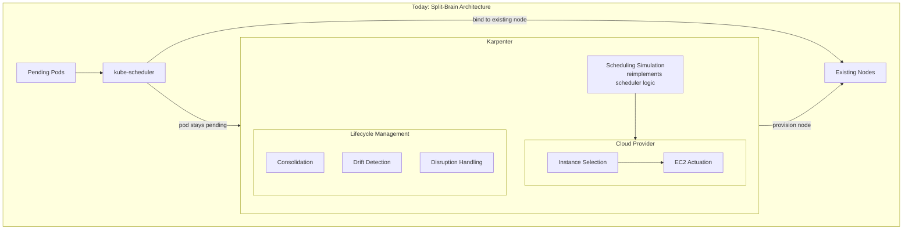
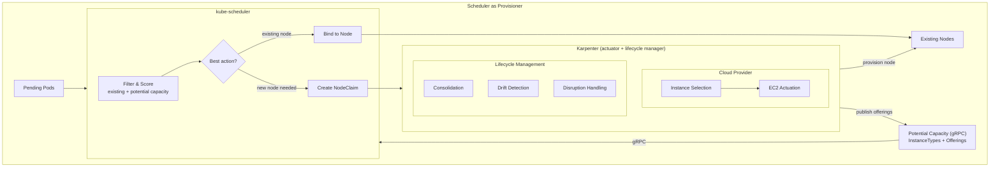
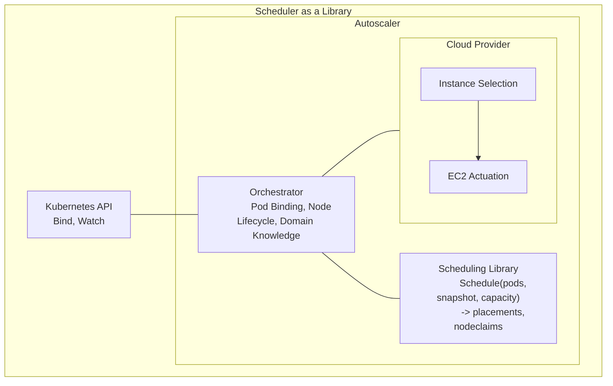

# Project Gluon: Implications for EKS Horizon

**Author:** Derek | **Date:** April 2026 | **Status:** Draft

---

## What Is This Project?

Workload-Aware Scheduler Autoscaling (WASA) is an upstream Kubernetes initiative, aligned on at the WAS Summit at KubeCon EU 2026 between the Cluster Autoscaler (CAS) and Karpenter communities, to integrate node autoscaling with kube-scheduler. Today, the scheduler and autoscaler are separate control loops that maintain independent views of the cluster. WASA eliminates that separation — making provisioning a first-class scheduling action rather than a reactive side-effect. Internally, we call our investment in this effort **Project Gluon** — because we're **glue**-ing Karpenter **on**-to the scheduler.

### The Problem Today

#### Split-Brain Architecture

The scheduler and autoscaler maintain independent views of the cluster. When a pod can't be placed, the scheduler finds no fit on existing nodes. The autoscaler then runs its own scheduling simulation — reimplementing the scheduler's filtering, scoring, and constraint logic — to decide what new capacity to provision.

These two simulations can disagree. The autoscaler may provision a node type the scheduler then refuses to use. The scheduler may pack pods onto existing nodes inefficiently because it can't see that a better-suited node could be provisioned alongside them. These disagreements cause wasted capacity, unnecessary cost, and scheduling failures that are difficult to diagnose.

#### Feature Parity Tax

Every new Kubernetes scheduling feature must be independently reimplemented by every autoscaler. Consider DRA (Dynamic Resource Allocation): the scheduler must understand device claims, allocation policies, and device topology to place pods correctly. For the autoscaler to make correct provisioning decisions, it must *also* understand all of these semantics — because it needs to predict whether the scheduler will actually use a node it provisions.

This creates a permanent feature lag. When DRA semantics change upstream, Karpenter must update its internal model to match. When topology spread constraints gain new capabilities, Karpenter must reimplement them. When any scheduling plugin changes behavior, Karpenter must detect and adapt. The team is effectively maintaining a parallel scheduler that must stay in lockstep with upstream — a burden that grows with every Kubernetes release.

#### No Node Lifecycle Awareness

The scheduler has no visibility into a node's future. It doesn't know which nodes are drifted, expiring, scheduled for maintenance, or about to be drained. It optimizes for the cluster as it exists right now — packing pods onto whichever node has the best fit today.

#### Maintainer Bottleneck

The scheduling simulation is the most expensive maintenance surface in Karpenter's codebase. It is the primary barrier to growing new maintainers — Karpenter has historically struggled to sustain more than two active reviewers. It can take years to develop the expertise, and normal attrition erases progress.

#### Autoscaling compliance: KEP-5328

[KEP-5328](https://github.com/kubernetes/enhancements/pull/5797) (Node Declared Features) introduced a mechanism for nodes to declare their capabilities for version-skew-safe scheduling. During review, the autoscaling team flagged that this breaks scale-from-zero: autoscalers can't populate declared features for nodes that don't exist yet. The community acknowledged the concern and shipped the KEP to beta anyway. The SIG Scheduling reviewers explicitly noted that scale-from-zero "will remain autoscaling SIGs concern" and that the KEP was "not a scheduling concern."

The autoscaler teams were left to vendor a shared library, integrate it per cloud provider, and track which features enter the framework every release — indefinitely. This is the dynamic WASA addresses: features designed in one SIG, with autoscaling implications treated as someone else's problem.

### What Changes

Both proposed architectures solve the same core problems — eliminating the split-brain, ending the feature parity tax, and making autoscaling a community-shared responsibility. They differ in where orchestration lives.

#### Today: Split-Brain Architecture

The scheduler and autoscaler operate as independent control loops. When pods can't be placed, they stay pending until the autoscaler notices, runs its own scheduling simulation, and decides what capacity to provision. Neither component has visibility into what the other is doing.

#### Option A: Scheduler as Provisioner

The upstream community's current direction. Provisioning logic moves into kube-scheduler. The scheduler evaluates existing nodes, in-flight nodes, and potential capacity in a single decision cycle. When it decides a new node is needed, it creates a capacity request directly. The autoscaler sheds its scheduling simulation and becomes a cloud provider actuator and lifecycle manager.

The scheduler gains awareness of potential capacity over gRPC — instance types, offerings, and availability signals are served directly to the scheduler without going through the API server. When the scheduler decides to provision, it creates a NodeClaim — a Kubernetes API object that serves as the handoff contract between the scheduler and the capacity provider.

#### Option B: Scheduler as a Library

An alternative architecture we are advocating. Instead of moving provisioning into the scheduler, scheduling logic is extracted as a library that the autoscaler invokes. The autoscaler becomes the orchestrator — owning pod binding, node lifecycle, and capacity provider integration — while the scheduling library provides a single source of truth for placement decisions.

The scheduling library, orchestrator, and capacity provider share a process. The interfaces between them are function calls with shared state — no serialization overhead, no eventual consistency. Scheduling decisions have full lifecycle context (which nodes are drifted, expiring, being drained) because the library runs in the same process as the lifecycle manager.

In static clusters without an autoscaler, kube-scheduler continues to operate exactly as it does today.

---

## Implications for EKS Horizon (Exploratory)

The sections above describe the upstream project and its motivations. The implications below are less fully developed — they describe doors this architecture opens for EKS Horizon specifically, not commitments.

### Federated Clusters

In a federated model, a top-level orchestrator distributes work across sharded regional clusters. The orchestrator needs to make placement decisions across regions — "given the workload requirements and the capacity available in each region, where should this work go?" Today, answering that question accurately would require the orchestrator to reimplement scheduling logic — the same split-brain problem described above, but at a higher level of abstraction.

Both proposed architectures produce a scheduler that can evaluate potential capacity alongside existing capacity using the full Kubernetes scheduling pipeline. In the federated model, the orchestrator could query a scheduler per region — "given the potential capacity in us-west-2, which node would you select for this workload?" — and get a Kubernetes-compliant answer without reimplementing any scheduling logic. This simplifies the orchestrator to a routing layer over accurate, per-region scheduling evaluations.

If EC2 provides an API that can validate or confirm this decision, the orchestrator can also leverage that functionality in a similar manner. 

### Multi-Region Clusters

In the multi-region cluster model, a single cluster has nodes attached from different regions. 

Both proposed architectures introduce autoscaler-agnostic primitives that decouple the scheduler's capacity view from any specific provider. A capacity provider per region could independently publish offerings into the same cluster. The scheduler evaluates all offerings uniformly and dispatches capacity requests to the appropriate regional provider.

This means the scheduler can make globally optimal placement decisions across regions in a single evaluation without requiring a single monolithic capacity provider that understands every region.

This does not solve the performance bottleneck that this single scheduler would become. It may also introduce performance bottlenecks as we scale the number of offerings.

### Deep EC2 Capacity Knowledge

Both proposed architectures introduce a Potential Capacity API designed to carry a richer dataset than what Karpenter consumes today, notably non-boolean availability signals. If EC2 is willing to provide EKS with a private API detailing additional capacity information, this project creates the surface to leverage that data through the managed control plane — without necessarily requiring a customer-facing product like EKS Auto as the integration point.

### Scheduling Action Ordering

The scheduler has four possible actions for a pending pod: **bind** to an existing node, **preempt** a lower-priority pod to make room, **wait** for in-flight capacity, or **provision** new capacity. Today, the scheduler only controls the first three. Provisioning is a separate control loop — the autoscaler reacts to pending pods independently. This means the scheduler can never compare provisioning against the other actions or apply a policy across all of them.

Both proposed architectures add provisioning to the scheduler's action set. For the first time, a policy can order all four actions relative to each other — "provision spot capacity first, preempt if unavailable, wait as a last resort" or "prefer existing capacity, wait briefly, only provision if nothing materializes." These are scheduling decisions that are impossible today because provisioning isn't in the scheduler's decision space.

While this does not have direct implications for EKS Horizon, it tackles some of the pain points that cause customers to request multi cluster orchestration. Notably, Snap's request for preemption with a grace period.

### Capacity Reservations and Buffers

At KubeCon EU 2026, sig-scheduling, Kueue, and Karpenter maintainers discussed building an API that allows job submission tools like Kueue to inform both the provisioner and the scheduler that a workload is coming — and to reserve and provision capacity for it before the pods exist.

Today, buffer capacity can be provisioned through workarounds like placeholder pods, but the scheduler doesn't respect these buffers. It will schedule unrelated pods onto buffer capacity because it has no concept of a reservation. There is no standard mechanism for a job orchestrator to say "I'm about to submit 64 GPU pods — provision this capacity and hold it for me."

A reservation API would close this gap — telling the scheduler that specific capacity is spoken for and must not be used for other work. Both proposed architectures create the primitives this would build on, but the reservation API itself is not expected to be solved in the short term.
